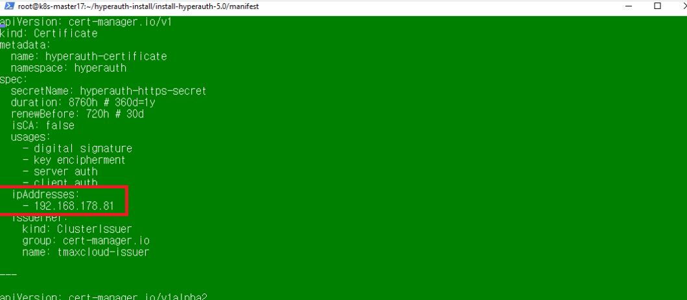
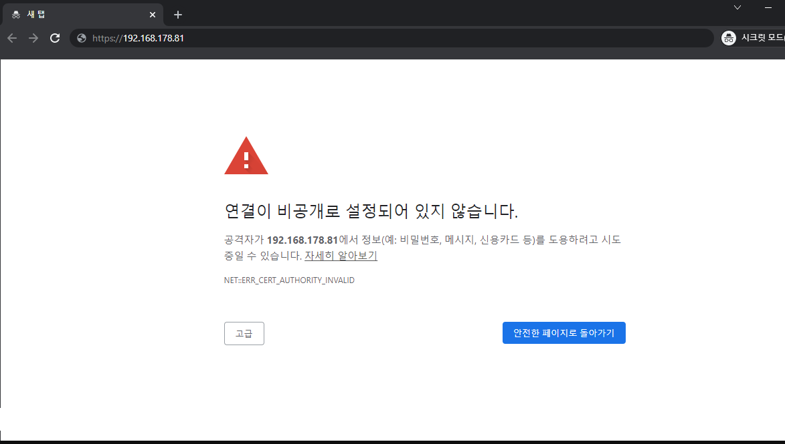
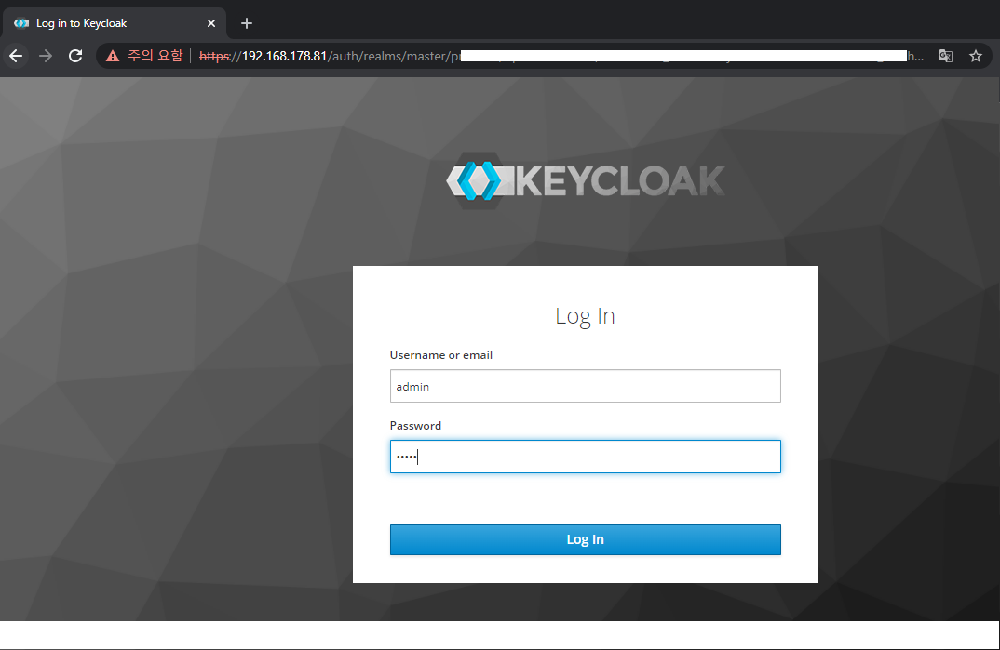
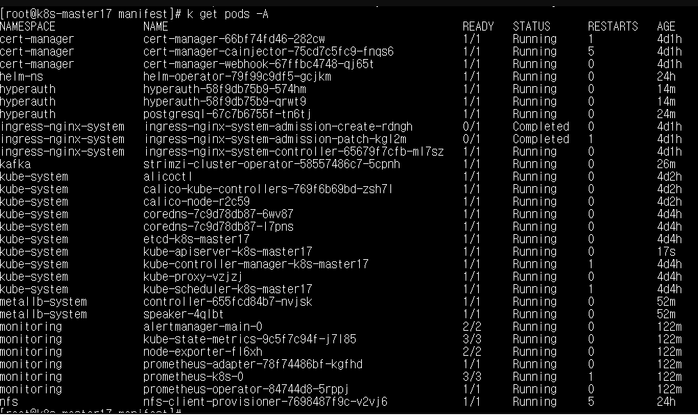

# HyperAuth 설치 가이드

## 구성 요소 및 버전
* hyperauth
    * [tmaxcloudck/hyperauth:latest](https://hub.docker.com/layers/tmaxcloudck/hyperauth/latest/images/sha256-b4c423520434c37f4c1166f94de7cfa49be43f51efe9f19da10776375b3fd840?context=explore)
* postgres
    * postgres:9.6.2-alpine
* zookeeper
    * wurstmeister/zookeeper:3.4.6
* kafka
    * wurstmeister/kafka:2.12-2.0.1
    
## SPEC (21.01.25)
### Hyperauth
cpu : 300m
memory: 300Mi

## DB (Postgresql, tibero)
cpu: 300
memory: 300Mi
Storage: 100Gi

### Kafka X 3
cpu : 100m
memory: 100Mi
Storage: 5Gi

### Zookeeper
cpu : 100m
memory: 100Mi
Storage: 5Gi

## Prerequisites
* Java binary
* jq binary

* Storage class
  * 아래 명령어를 통해 storage class가 설치되어 있는지 확인
    * `kubectl get storageclass`
	

  * 만약 아무 storage class가 없다면 아래 2가지 방법중 하나로 rook-ceph나 storageclass를 구축, 설치 진행 
    * https://github.com/tmax-cloud/hypercloud-install-guide/tree/4.1/rook-ceph
	* apply -f ~/nfs-install/deploy/class.yaml로 배포해 StorageClass를 생성
  * Storage class는 있지만 default로 설정된 것이 없다면 아래 명령어를 실행한다.
    * `kubectl patch storageclass nfs -p '{"metadata": {"annotations":{"storageclass.kubernetes.io/is-default-class":"true"}}}'`
	* `ex) #kubectl patch storageclass {스토리지클래스 명} -p '{"metadata": {"annotations":{"storageclass.kubernetes.io/is-default-class":"true"}}}'`
  * storage class명은 사용자가 생성한 스토리지 이름으로 사용해도 무관
  
  
  


## 폐쇄망 구축 가이드
1. **폐쇄망에서 설치하는 경우** 사용하는 image repository에 필요한 이미지를 push한다. 

    * github에서 hyperauth 생성에 필요한 파일 다운로드
    ```bash
	cd ~ 
	git clone https://github.com/learncloud/install-hyperauth-5.0.git
	cd install-hyperauth-5.0/manifest/

	# For Hyperauth
	export HYPERAUTH_HOME=~/install-hyperauth-5.0
	cd ${HYPERAUTH_HOME}
 	export POSTGRES_VERSION=9.6.2-alpine
	export HYPERAUTH_VERSION=b1.1.1.10
   	export REGISTRY=192.168.178.17:5000
	
	# <tag1>에는 설치할 hyperauth 버전 명시
		예시: $ export HYPERAUTH_VERSION=1.1.1.10
	# <REGISTRY_IP_PORT>에는 폐쇄망 Docker Registry IP:PORT명시
		예시: $ export REGISTRY=192.168.6.110:5000
    ```


    * 외부 네트워크 통신이 가능한 환경에서 필요한 이미지를 다운받는다.
    ```bash
	# postgres
	sudo docker pull postgres:${POSTGRES_VERSION}
	sudo docker save postgres:${POSTGRES_VERSION} > postgres_${POSTGRES_VERSION}.tar

	# hyperauth
	sudo docker pull tmaxcloudck/hyperauth:b${HYPERAUTH_VERSION}
	sudo docker save tmaxcloudck/hyperauth:b${HYPERAUTH_VERSION} > hyperauth_b${HYPERAUTH_VERSION}.tar

    ```
  
2. 위의 과정에서 생성한 tar 파일들을 `폐쇄망 환경으로 이동`시킨 뒤 사용하려는 registry에 이미지를 push한다.
	
    * 이미지 load 및 push
    ```bash
    # Load Images
	sudo docker load < postgres_${POSTGRES_VERSION}.tar
	sudo docker load < hyperauth_b${HYPERAUTH_VERSION}.tar

    # Change Image's Tag For Private Registry
	sudo docker tag postgres:${POSTGRES_VERSION} ${REGISTRY}/postgres:${POSTGRES_VERSION}
	sudo docker tag tmaxcloudck/hyperauth:b${HYPERAUTH_VERSION} ${REGISTRY}/hyperauth:b${HYPERAUTH_VERSION}
    
    # Push Images
	sudo docker push ${REGISTRY}/postgres:${POSTGRES_VERSION}
	sudo docker push ${REGISTRY}/hyperauth:b${HYPERAUTH_VERSION}

    ```

## 설치 가이드
1. [초기화 작업](#step-1-%EC%B4%88%EA%B8%B0%ED%99%94-%EC%9E%91%EC%97%85)
2. [SSL 인증서 생성](#step-2-ssl-%EC%9D%B8%EC%A6%9D%EC%84%9C-%EC%83%9D%EC%84%B1)
3. [HyperAuth Deployment 생성](#step-3-hyperauth-deployment-%EB%B0%B0%ED%8F%AC)
4. [Kafka Topic Server 설치](#step-4-kafka-topic-server-%EC%84%A4%EC%B9%98)
5. [Kubernetes OIDC 연동](#step-5-kubernetes-oidc-%EC%97%B0%EB%8F%99)

## Step 1. 초기화 작업 및 yaml 수정
* 목적 : `HyperAuth 구축을 위한 초기화 작업, Secret생성 및 DB 구축, Yaml 버전 수정`
* 아래의 command를 수정하여 사용하고자 하는 image 버전 정보를 수정한다.
```bash
#hyperauth 다운후 진행 (notion과 git 내용이 다르니 참고)
	
export POSTGRES_VERSION=9.6.2-alpine
sed -i 's/POSTGRES_VERSION/'${POSTGRES_VERSION}'/g' 1.initialization.yaml
export HYPERAUTH_VERSION=b1.1.1.10
sed -i 's/HYPERAUTH_VERSION/'${HYPERAUTH_VERSION}'/g' 2.hyperauth_deployment.yaml

```

* 생성 순서 :
	* kakfa namespace에 strimzi-cluster-operator가 깔려있지 않으면, [strimzi-cluster-operator.yaml](manifest/strimzi-cluster-operator.yaml) 실행 `ex) kubectl apply -f strimzi-cluster-operator.yaml`) 
	* [1.initialization.yaml](manifest/1.initialization.yaml) 실행 `ex) kubectl apply -f 1.initialization.yaml`)
* 비고 : 아래 명령어 수행 후, Postgre Admin 접속 확인
```bash
kubectl exec -it $(kubectl get pods -n hyperauth | grep postgre | cut -d ' ' -f1) -n hyperauth -- bash
psql -U keycloak keycloak

```
 

## Step 2. SSL 인증서 생성
* 목적 : `HTTPS 인증을 위한 인증서, kafka와의 통신을 위한 keystore, truststore를 생성하고 secret으로 변환`
* 생성 순서 : 
	* cert-manager가 설치되어 있고, tmaxcloud-issuer (ClusterIssuer) 가 생성되어 있다고 가정한다. 
		* cert-manager 설치는 https://cert-manager.io/docs/installation  	
		* 생성이 안되어 있는 경우, [tmaxcloud-issuer.yaml](manifest/tmaxcloud-issuer.yaml) 실행 `ex) kubectl apply -f tmaxcloud-issuer.yaml`) 
	* [hyperauth_certs.yaml](manifest/hyperauth_certs.yaml) 의 변수를 상황에 맞게 치환한다. 안쓰는 변수 부분은 지워준다.
		* Hyperauth
			* Hyperauth를 IP로 노출하는 경우, {HYPERAUTH_EXTERNAL_IP} 세팅, dnsName 부분 전체 삭제
			* Hyperauth를 DNS로 노출하는 경우, {HYPERAUTH_EXTERNAL_DNS} 세팅, ipAddresses 부분 전체 삭제

			

	*  [hyperauth_certs.yaml](manifest/hyperauth_certs.yaml) 실행 `ex) kubectl apply -f hyperauth_certs.yaml`)
	*  Hyperauth Namespace에 hyperauth-https-secret, hyperauth-kafka-jks, kafka-jks Secret이 생성된걸 확인 (`kubectl get secrets -n hyperauth`)

	


 	* hyperauth-https-secret으로 부터 root-ca, hyperauth 인증서를 추출해서 kubernetes pki 에 위치

```bash
    kubectl get secret hyperauth-https-secret -n hyperauth -o jsonpath="{['data']['tls\.crt']}" | base64 -d > ./hyperauth.crt
    kubectl get secret hyperauth-https-secret -n hyperauth -o jsonpath="{['data']['ca\.crt']}" | base64 -d > ./hypercloud-root-ca.crt
    cp ./hyperauth.crt /etc/kubernetes/pki/hyperauth.crt
    cp ./hypercloud-root-ca.crt /etc/kubernetes/pki/hypercloud-root-ca.crt
 ``` 
* 비고 : 
    * Kubernetes Master가 다중화 된 경우, hypercloud-root-ca.crt, hyperauth.crt를 각 Master 노드들의 /etc/kubernetes/pki/hypercloud-root-ca.crt, /etc/kubernetes/pki/hyperauth.crt 로 cp해야합니다

## Step 3. HyperAuth Deployment 배포
* 목적 : `HyperAuth 설치`
* 생성 순서 :
    * [2.hyperauth_deployment.yaml](manifest/2.hyperauth_deployment.yaml) 실행 `ex) kubectl apply -f 2.hyperauth_deployment.yaml`
    * HyperAuth Admin Console에 접속 확인
        * `kubectl get svc hyperauth -n hyperauth` 명령어로 IP 확인
        * 계정 : admin/admin
	
	

	

	* 결과확인
		


* 비고 :
    * K8s admin 기본 계정 정보 : hc-admin@tmax.co.kr/Tmaxadmin1!
    * HyperAuth User 메뉴에서 비밀번호는 변경 가능, ID를 위해서는 clusterrole도 변경 필요
    
## Step 4. Kafka Topic Server 설치 (**현재는 생략**)
* 목적 : `Hyperauth의 Event를 Subscribe 할수 있는 kafka server 설치`
* 생성 순서 :
 	* [3.kafka_deployment.yaml](manifest/3.kafka_deployment.yaml) 실행 `ex) kubectl apply -f 3.kafka_deployment.yaml`
* 비고 : 
	* hyperauth 이미지 tmaxcloudck/hyperauth:b1.0.15.31 이후부터 설치 적용할 것!
	* [kafka_client.yaml](manifest/3.kafka_client.yaml) 로 pub/sub테스트 가능
		*  kafka_client pod에 접속 후
			* Producer : 
			```bash
				export PASSWORD=tmax@23
				export KAFKA_OPTS=" \
				  -Djavax.net.ssl.trustStore=/opt/kafka/certificates/truststore.jks \
				  -Djavax.net.ssl.trustStorePassword=$PASSWORD \
				  -Djavax.net.ssl.trustStoreType=PKCS12"
			  	/opt/kafka/bin/kafka-console-producer.sh --broker-list \
				  kafka-kafka-bootstrap.hyperauth:9092 --topic tmax\
				  --producer-property 'security.protocol=SSL'
			```
			* Consumer :
			```bash
				export PASSWORD=tmax@23
				export KAFKA_OPTS=" \
				  -Djavax.net.ssl.trustStore=/opt/kafka/certificates/truststore.jks \
				  -Djavax.net.ssl.trustStorePassword=$PASSWORD \
				  -Djavax.net.ssl.trustStoreType=PKCS12"
				/opt/kafka/bin/kafka-console-consumer.sh --bootstrap-server \
				  kafka-kafka-bootstrap.hyperauth:9092 --topic tmax\
				  --consumer-property 'security.protocol=SSL' \
				  --group consumer1
			```
 
    
## Step 5. Kubernetes OIDC 연동
* 목적 : `Kubernetes의 RBAC 시스템과 HyperAuth 인증 연동`
* 생성 순서 :
	* Kubernetes Cluster Master Node에 접속
	* {HYPERAUTH_SERVICE_IP} = $(kubectl describe service hyperauth -n hyperauth | grep 'LoadBalancer Ingress' | cut -d ' ' -f7)
	* `/etc/kubernetes/manifests/kube-apiserver.yaml` 의 spec.containers[0].command[] 절에 아래 command를 추가
    
    ```yaml
    --oidc-issuer-url=https://{HYPERAUTH_SERVICE_IP}/auth/realms/tmax
    --oidc-client-id=hypercloud5
    --oidc-username-claim=preferred_username
    --oidc-username-prefix=-
    --oidc-groups-claim=group
    --oidc-ca-file=/etc/kubernetes/pki/hyperauth.crt
    ```
    


	* 재시작후 결화 화면
	
	


* 비고 :
    * 자동으로 kube-apiserver 가 재기동 됨

## Step 6. Prometheus 연동 (Optional)
* 목적 : `Prometheus 모니터링 시스템과 HyperAuth 이벤트 metrics 연동`
* 필수 요건 
    * Prometheus 설치 : https://github.com/tmax-cloud/install-prometheus 참조
    * Admin Console (tmax realm) - Events - Config - Events Config : prometheus-metric-listener 추가
    * [1.initialization.yaml](manifest/1.initialization.yaml)를 참고하여 passwords Secret에 HYPERAUTH_ADMIN을 추가한다. (hyperauth master realm admin의 아이디를 base64 encoding 하여 생성)

* 생성 순서 :
    * ServiceMonitor 생성
    * [4.hyperauth_service_pod_monitor.yaml](manifest/4.hyperauth_service_pod_monitor.yaml) 실행 `ex) kubectl apply -f 4.hyperauth_service_pod_monitor.yaml`
    
* 비고 :
    * 자동으로 Prometheus가 수집을 시작함
    * grafana dashboard import
        * grafana - import - https://github.com/tmax-cloud/install-hyperauth/blob/main/manifest/hyperauth_grafana_dashboard.json 내용 붙여넣기
        * grafana - import - https://github.com/tmax-cloud/install-hyperauth/blob/main/manifest/kafka_grafana_dashboard.json 내용 붙여넣기
        * grafana - import - https://github.com/tmax-cloud/install-hyperauth/blob/main/manifest/kafka_exporter_grafana_dashboard.json 내용 붙여넣기
        * grafana - import - https://github.com/tmax-cloud/install-hyperauth/blob/main/manifest/zookeeper_grafana_dashboard.json 내용 붙여넣기


## 참고자료 ( Ingress를 사용해서 hyperauth를 노출하려고 하는 경우 )
* hyperauth_traefik_ingress.yaml 에서 host 및 hosts를 환경에 맞는 dns로 수정하고 apply한다.
* 모든 마스터 노드에 관해서 self-signed 인증서의 경우, os의 ca store에 등록하는 과정을 거쳐야 k8s가 공인 인증서로 써 신뢰한다. 
    * hypercloud-root-ca.crt, hyperauth.crt를 /etc/pki/ca-trust/source/anchors/ 밑에 복사한다. (centOS 기준)
    * update-ca-trust  	
    

## 삭제 가이드
